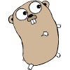

Hey, you! Yes, you!
*******************

See the little gopher? Isn't it cute? Yes it is! He is the mascot of the Go
programming language *---Go, what?* Go, the programming language! 

This website is an online book that aims to introduce people to this awesome
language. And if you, actually, stumbled upon it while looking for real gophers,
let me still invite you to read it and learn something cool! 

Welcome aboard
==============
.. container:: side

    In this part, we will learn the very basic things about Go. The basic syntax
    for simple programs, how to declare variables, pointers and how to use basic
    control structures.

.. toctree::
   :maxdepth: 1

   preface
   first
   hello
   basic
   pointers
   control

Let's combine stuff
===================
.. container:: side

    Now, it's time to play like with Legos. We use primitive data types and
    basic control structures, that we saw in the previous part, to build
    composite types and functions.

.. toctree::
   :maxdepth: 1

   functions
   composite
   slices
   maps

And be smart and awesome
========================
.. container:: side

    We will learn smarter and nicer things about functions, and will have fun
    writing code to represent and solve real world problems (well... real as in
    objects. ---You know what I mean)

.. toctree::
   :maxdepth: 1

   more-functions
   even-more-functions
   methods
   more-methods
   interfaces
   more-interfaces

Like a maestro with his orchestra
=================================
.. container:: side

    Why think of programs as a sequential ballade executed by a single musician?
    We can do better by making every musician do what he/she has to do, and make
    them *communicate* with one another.

* Introduction to concurrency with Go
* Communicating with channels
* More on channels
* ...

.. toctree::
    :maxdepth: 1

    colophon

And still be open and friendly
==============================
This is the goal of this humble work. I hope that you'll enjoy reading it, and
I'd love to hear back from you! You can post issues, typos and suggestions on
the `github repository`_

.. _github repository: https://github.com/initpy/go-book/issues

.. toctree::
    :hidden:

    contents
